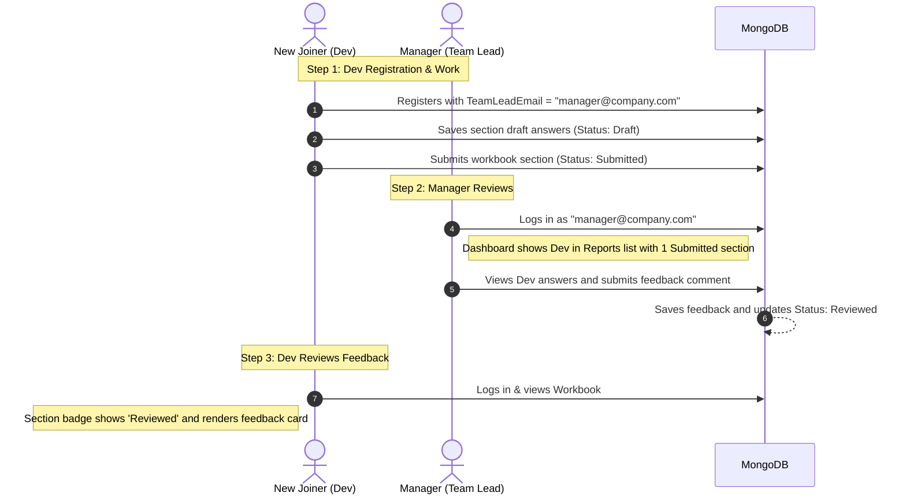

# Dev Onboarding Workbook 

This is a modern ASP.NET Core Web App designed to facilitate a **continuous feedback loop** between managers (team leads) and new developers during their onboarding journey. Built using Clean Architecture principles, MediatR, and MongoDB, it provides a structured, responsive, and persistent space to document progress and receive mentor feedback.

🚀 **Live Demo**: [developerworkbook-e3fza9e2hth7agd3.southafricanorth-01.azurewebsites.net](https://developerworkbook-e3fza9e2hth7agd3.southafricanorth-01.azurewebsites.net/)

---

## Open Source & Customization

This project is fully open source! We encourage the developer community to customize, extend, and adapt Dev Workbook to fit their organization's unique onboarding journey.

To get started with custom development:
1. **Fork this repository** to your own GitHub account.
2. Customize the default sections and questions by modifying the JSON configuration in [workbookSections.json](file:///c:/Projects/DeveloperWorkbook/Workbook.WebApp/workbookSections.json).
3. Push changes and build custom features to adapt the interface to your desire.

---

## Features

* **Developer Workbook**: A structured reflection workspace broken down into sections (e.g. Getting Started, Learning by Doing, Progress Tracker).
* **Draft & Submission States**: Developers can save incremental drafts of their answers, or submit them directly to their manager for review.
* **Autosave / Upsert Mode**: Safe, collision-free database persistence in MongoDB that replaces old versions without creating duplicates.
* **Manager Review Portal**: An interactive dashboard showing a list of direct reports, progress percentages, and detailed section-by-section review and feedback comment inputs.
* **Secure Cookies Authentication**: Secure authentication pipeline redirecting users straight to their dashboards.

---

## Manager-Joiner Feedback Loop

The system enables continuous communication between developers and team leads:



---

## Tech Stack

* **Core**: ASP.NET Core Razor Pages (net9.0)
* **CQRS Pattern**: MediatR for clean request/handler separation
* **Database**: MongoDB (Document-based persistence)
* **Authentication**: Cookie-based ASP.NET Identity (no JWT)
* **Styling**: Bootstrap 5 with FontAwesome icons

---

## Clean Folder Structure

```plaintext
DeveloperWorkbook
├── Workbook.Core           # Core domain models (e.g. Users, WorkbookAnswer)
├── Workbook.Application    # MediatR Commands, Handlers, Interfaces
├── Workbook.Infrastructure # MongoDB implementations, Authentication services
└── Workbook.WebApp         # Razor Pages, Web assets (css/js), and View Models
```

---

## Infrastructure & Credentials Setup

To run the full onboarding flow successfully (including manager notifications and secure passwordless OTP logins), you need to configure your database and mail credentials. To keep your credentials secure, we recommend using .NET User Secrets during local development instead of putting passwords in `appsettings.json`.

### 1. MongoDB Atlas Setup (Cloud Database)
1. Sign up or log into [MongoDB Atlas](https://www.mongodb.com/cloud/atlas).
2. Create a free cluster (Shared M0) and name your database (e.g. `DevsWorkbookDb`).
3. Under **Database Access**, create a user with read/write privileges.
4. Under **Network Access**, allow access from your local IP address (or `0.0.0.0/0` for any location).
5. Go to **Database** -> **Connect** -> **Drivers**, select C#/.NET, and copy your connection string (e.g., `mongodb+srv://<username>:<password>@cluster.mongodb.net/`).
6. In your terminal, initialize user secrets and save the connection string locally:
   ```bash
   dotnet user-secrets init --project Workbook.WebApp
   dotnet user-secrets set "MongoDbSettings:ConnectionString" "YOUR_MONGODB_ATLAS_CONNECTION_STRING" --project Workbook.WebApp
   ```

### 2. SMTP Mail Server Setup (Notifications & OTP)
To send OTP verification codes and manager alerts, configure an SMTP server (such as Mailtrap for testing, or SendGrid, Gmail App Passwords, etc. for production):
1. Retrieve your SMTP host, port, username, and password credentials.
2. Save these credentials in your local user secrets:
   ```bash
   dotnet user-secrets set "SmtpSettings:Username" "YOUR_SMTP_USERNAME" --project Workbook.WebApp
   dotnet user-secrets set "SmtpSettings:Password" "YOUR_SMTP_PASSWORD" --project Workbook.WebApp
   dotnet user-secrets set "SmtpSettings:Host" "YOUR_SMTP_HOST" --project Workbook.WebApp
   dotnet user-secrets set "SmtpSettings:Port" "587" --project Workbook.WebApp
   ```

---

## Getting Started

### Prerequisites
* [.NET 9 SDK](https://dotnet.microsoft.com/download/dotnet/9.0)
* **MongoDB**: A running MongoDB instance. By default, the project is pre-configured to connect to a cloud-hosted MongoDB Atlas cluster for instant setup. Alternatively, you can run [MongoDB Community Server](https://www.mongodb.com/try/download/community) locally on port `27017`.

### Running the App
1. Clone the repository and navigate to the project directory:
   ```bash
   cd c:/Projects/DeveloperWorkbook
   ```
2. Verify database settings in [appsettings.json](file:///c:/Projects/DeveloperWorkbook/Workbook.WebApp/appsettings.json). The cluster connection string is located under `MongoDbSettings.ConnectionString`.
3. Launch the development server:
   ```bash
   dotnet run --project Workbook.WebApp
   ```
4. Open your browser and navigate to `http://localhost:5043` (or the HTTP port output in the terminal).
