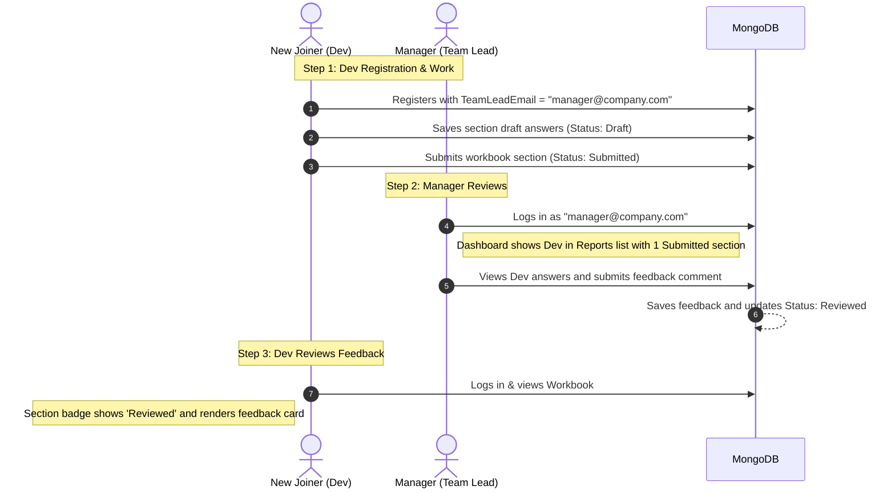

# Dev Onboarding Workbook 

This is a modern ASP.NET Core Web App designed to facilitate a **continuous feedback loop** between managers (team leads) and new developers during their onboarding journey. Built using Clean Architecture principles, MediatR, and MongoDB, it provides a structured, responsive, and persistent space to document progress and receive mentor feedback.

---

## Features

* **Developer Workbook**: A structured reflection workspace broken down into sections (e.g. Getting Started, Learning by Doing, Progress Tracker).
* **Draft & Submission States**: Developers can save incremental drafts of their answers, or submit them directly to their manager for review.
* **Autosave / Upsert Mode**: Safe, collision-free database persistence in MongoDB that replaces old versions without creating duplicates.
* **Manager Review Portal**: An interactive dashboard showing a list of direct reports, progress percentages, and detailed section-by-section review and feedback comment inputs.
* **Secure Cookies Authentication**: Secure authentication pipeline redirecting users straight to their dashboards.

---

## Manager-Joiner Feedback Loop

The system enables continuous communication between developers and team leads:



---

## Tech Stack

* **Core**: ASP.NET Core Razor Pages (net9.0)
* **CQRS Pattern**: MediatR for clean request/handler separation
* **Database**: MongoDB (Document-based persistence)
* **Authentication**: Cookie-based ASP.NET Identity (no JWT)
* **Styling**: Bootstrap 5 with FontAwesome icons

---

## Clean Folder Structure

```plaintext
DeveloperWorkbook
├── Workbook.Core           # Core domain models (e.g. Users, WorkbookAnswer)
├── Workbook.Application    # MediatR Commands, Handlers, Interfaces
├── Workbook.Infrastructure # MongoDB implementations, Authentication services
└── Workbook.WebApp         # Razor Pages, Web assets (css/js), and View Models
```

---

## Getting Started

### Prerequisites
* [.NET 9 SDK](https://dotnet.microsoft.com/download/dotnet/9.0)
* [MongoDB Community Server](https://www.mongodb.com/try/download/community) running locally on port `27017`

### Running the App
1. Clone the repository and navigate to the project directory:
   ```bash
   cd c:/Projects/DeveloperWorkbook
   ```
2. Verify database settings in `Workbook.WebApp/appsettings.json`. By default, it connects to `mongodb://localhost:27017/`.
3. Launch the development server:
   ```bash
   dotnet run --project Workbook.WebApp
   ```
4. Open your browser and navigate to `https://localhost:7198` (or the HTTP port output in the terminal).
