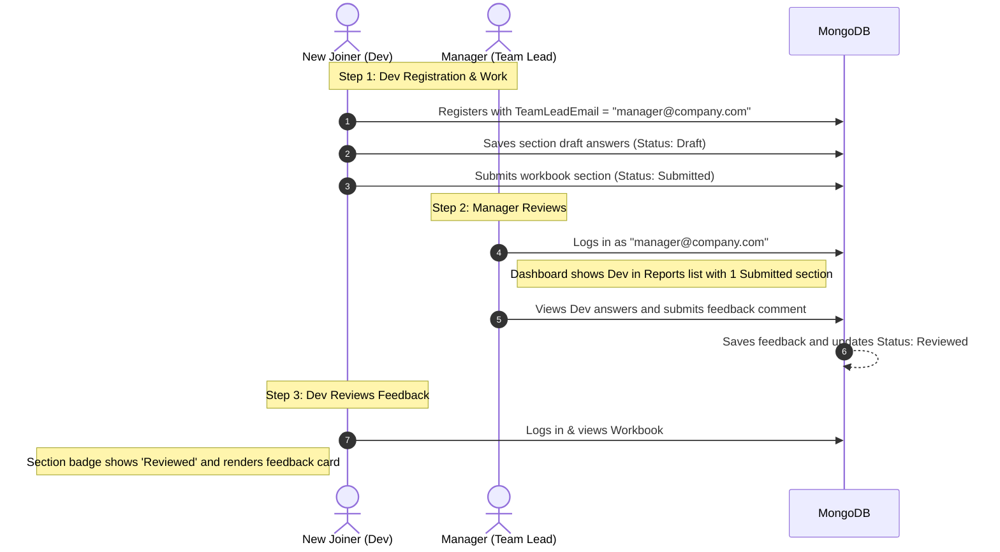
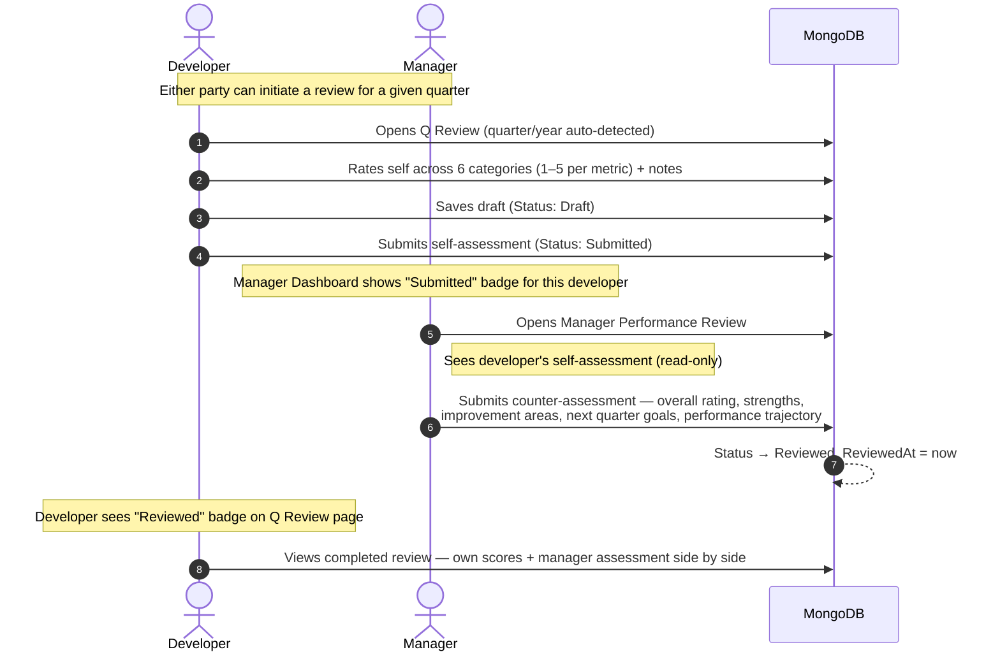

# Dev Workbook

This is a modern ASP.NET Core Web App designed to facilitate a **continuous feedback loop** between developers — new hires, tenured engineers, or contractors between engagements — and whoever they report to. From first-day onboarding all the way through recurring quarterly performance reviews, it provides a structured, responsive, and persistent space to document progress, reflect on growth, and exchange structured feedback. Built using Clean Architecture principles, MediatR, and MongoDB.

**Live Demo**: [developerworkbook.onrender.com](https://developerworkbook.onrender.com/)

---

## Open Source & Customization

This project is fully open source! We encourage the developer community to customize, extend, and adapt Dev Workbook to fit their organization's unique onboarding journey.

To get started with custom development:
1. **Fork this repository** to your own GitHub account.
2. Customize onboarding sections and questions in [workbookSections.json](Workbook.WebApp/workbookSections.json).
3. Customize quarterly review categories and rated metrics in [performanceReviewSections.json](Workbook.WebApp/performanceReviewSections.json).
4. Push changes and build custom features to adapt the interface to your organisation's needs.

---

## Features

### Onboarding Workbook
* **Developer Workbook**: A structured reflection workspace broken down into configurable sections (Getting Started, Learning by Doing, Skills & Progress Tracker, and more).
* **Draft & Submission States**: Developers save incremental drafts and submit sections to their manager when ready.
* **Autosave / Upsert Mode**: Collision-free MongoDB persistence that replaces old versions without creating duplicates.
* **Manager Review Portal**: An interactive dashboard showing direct reports, onboarding progress percentages, and a section-by-section feedback interface.

### Quarterly Performance Reviews
* **Self-Assessment Form**: Developers rate themselves across six categories — Deliverables & Output, Code Quality, Reliability & Professionalism, Collaboration & Communication, Learning & Growth, and Goals for Next Quarter. Each rated item has a 1–5 score and a notes field.
* **Manager Counter-Assessment**: After a developer submits, managers provide an independent overall rating, highlight strengths and improvement areas, set goals for the next quarter, and assign a performance trajectory (On Track / Needs Support / Exceeding Expectations).
* **Quarter & Year Tracking**: Each review is keyed to a specific quarter (Q1–Q4) and year, building a historical record across quarters. The current quarter is auto-detected.
* **Flexible Initiation**: Either party can create a review for a given quarter — developers self-assess first, or managers can initiate and fill their side before the developer completes theirs.
* **Dashboard Integration**: The Manager Dashboard surfaces each direct report's current-quarter review status (Not Started / Draft / Submitted / Reviewed) alongside their onboarding progress.
* **Configurable Metrics**: All review categories and rated items are defined in `performanceReviewSections.json` — no code changes needed to adjust what gets measured.

### Platform
* **Secure Authentication**: Cookie-based auth for developers (email + password) and OTP-based passwordless login for managers.
* **Clean Architecture**: Domain, Application, Infrastructure, and Web layers with clear separation of concerns.

---

## Manager-Joiner Feedback Loop

The system enables continuous communication between developers and team leads:


```mermaid
sequenceDiagram
    autonumber
    actor Dev as New Joiner (Dev)
    actor Mgr as Manager (Team Lead)
    participant DB as MongoDB

    Note over Dev, Mgr: Step 1: Dev Registration & Work
    Dev->>DB: Registers with TeamLeadEmail = "manager@company.com"
    Dev->>DB: Saves section draft answers (Status: Draft)
    Dev->>DB: Submits workbook section (Status: Submitted)
    
    Note over Mgr: Step 2: Manager Reviews
    Mgr->>DB: Logs in as "manager@company.com"
    Note right of Mgr: Dashboard shows Dev in Reports list with 1 Submitted section
    Mgr->>DB: Views Dev answers and submits feedback comment
    DB-->>DB: Saves feedback and updates Status: Reviewed

    Note over Dev: Step 3: Dev Reviews Feedback
    Dev->>DB: Logs in & views Workbook
    Note left of Dev: Section badge shows 'Reviewed' and renders feedback card
```

---

## Quarterly Review Flow


```mermaid
sequenceDiagram
    autonumber
    actor Dev as Developer
    actor Mgr as Manager
    participant DB as MongoDB

    Note over Dev, Mgr: Either party can initiate a review for a given quarter

    Dev->>DB: Opens Q Review (quarter/year auto-detected)
    Dev->>DB: Rates self across 6 categories (1–5 per metric) + notes
    Dev->>DB: Saves draft (Status: Draft)
    Dev->>DB: Submits self-assessment (Status: Submitted)

    Note over Mgr: Manager Dashboard shows "Submitted" badge for this developer

    Mgr->>DB: Opens Manager Performance Review
    Note right of Mgr: Sees developer's self-assessment (read-only)
    Mgr->>DB: Submits counter-assessment — overall rating, strengths,<br/>improvement areas, next quarter goals, performance trajectory
    DB-->>DB: Status → Reviewed, ReviewedAt = now

    Note over Dev: Developer sees "Reviewed" badge on Q Review page
    Dev->>DB: Views completed review — own scores + manager assessment side by side
```

---

## Tech Stack

* **Core**: ASP.NET Core Razor Pages (net9.0)
* **CQRS Pattern**: MediatR for clean request/handler separation
* **Database**: MongoDB (Document-based persistence)
* **Authentication**: Cookie-based ASP.NET Identity (no JWT)
* **Styling**: Bootstrap 5 with FontAwesome icons

---

## Clean Folder Structure

```plaintext
DeveloperWorkbook
├── Workbook.Core           # Domain models: Users, WorkbookAnswer, PerformanceReview, etc.
├── Workbook.Application    # MediatR commands, handlers, and repository interfaces
├── Workbook.Infrastructure # MongoDB repositories, authentication, and email services
└── Workbook.WebApp         # Razor Pages, JSON config, web assets, and view models
    ├── workbookSections.json           # Configurable onboarding sections & questions
    └── performanceReviewSections.json  # Configurable quarterly review categories & metrics
```

---

## Infrastructure & Credentials Setup

To run the full onboarding flow successfully (including manager notifications and secure passwordless OTP logins), you need to configure your database and mail credentials. To keep your credentials secure, we recommend using .NET User Secrets during local development instead of putting passwords in `appsettings.json`.

### 1. MongoDB Atlas Setup (Cloud Database)
1. Sign up or log into [MongoDB Atlas](https://www.mongodb.com/cloud/atlas).
2. Create a free cluster (Shared M0) and name your database (e.g. `DevsWorkbookDb`).
3. Under **Database Access**, create a user with read/write privileges.
4. Under **Network Access**, allow access from your local IP address (or `0.0.0.0/0` for any location).
5. Go to **Database** -> **Connect** -> **Drivers**, select C#/.NET, and copy your connection string (e.g., `mongodb+srv://<username>:<password>@cluster.mongodb.net/`).
6. In your terminal, initialize user secrets and save the connection string locally:
   ```bash
   dotnet user-secrets init --project Workbook.WebApp
   dotnet user-secrets set "MongoDbSettings:ConnectionString" "YOUR_MONGODB_ATLAS_CONNECTION_STRING" --project Workbook.WebApp
   ```

### 2. SMTP Mail Server Setup (Notifications & OTP)
To send OTP verification codes and manager alerts, configure an SMTP server (such as Mailtrap for testing, or SendGrid, Gmail App Passwords, etc. for production):
1. Retrieve your SMTP host, port, username, and password credentials.
2. Save these credentials in your local user secrets:
   ```bash
   dotnet user-secrets set "SmtpSettings:Username" "YOUR_SMTP_USERNAME" --project Workbook.WebApp
   dotnet user-secrets set "SmtpSettings:Password" "YOUR_SMTP_PASSWORD" --project Workbook.WebApp
   dotnet user-secrets set "SmtpSettings:Host" "YOUR_SMTP_HOST" --project Workbook.WebApp
   dotnet user-secrets set "SmtpSettings:Port" "587" --project Workbook.WebApp
   ```

---

## Getting Started

### Prerequisites
* [.NET 9 SDK](https://dotnet.microsoft.com/download/dotnet/9.0)
* **MongoDB**: A running MongoDB instance. By default, the project is pre-configured to connect to a cloud-hosted MongoDB Atlas cluster for instant setup. Alternatively, you can run [MongoDB Community Server](https://www.mongodb.com/try/download/community) locally on port `27017`.

### Running the App
1. Clone the repository and navigate to the project directory:
   ```bash
   cd c:/Projects/DeveloperWorkbook
   ```
2. Verify database settings in [appsettings.json](file:///c:/Projects/DeveloperWorkbook/Workbook.WebApp/appsettings.json). The cluster connection string is located under `MongoDbSettings.ConnectionString`.
3. Launch the development server:
   ```bash
   dotnet run --project Workbook.WebApp
   ```
4. Open your browser and navigate to `http://localhost:5043` (or the HTTP port output in the terminal).

---

## Deployment (Render)

The app is containerized (see [Dockerfile](Dockerfile)) and deployed to [Render](https://render.com) using the [render.yaml](render.yaml) Blueprint. MongoDB Atlas and SMTP are both external services, so no cloud-specific code is required — the same image can run on any container host.

1. Push this repo to GitHub (or your fork) and log in to Render.
2. **New > Blueprint**, point it at the repo — Render will read `render.yaml` and provision a free web service from the Dockerfile.
3. Fill in the secret env vars flagged `sync: false` in `render.yaml` (`MongoDbSettings__ConnectionString`, `SmtpSettings__Host`, `SmtpSettings__Username`, `SmtpSettings__Password`, `SmtpSettings__FromAddress`) in the Render dashboard.
4. Deploy. Render auto-builds and redeploys on every push to the connected branch — no GitHub Actions step is needed for deploy; [ci.yml](.github/workflows/ci.yml) just runs a build check on PRs.

Note: Render's free tier spins the service down after 15 minutes of inactivity, so the first request after idling will be slow (cold start).
